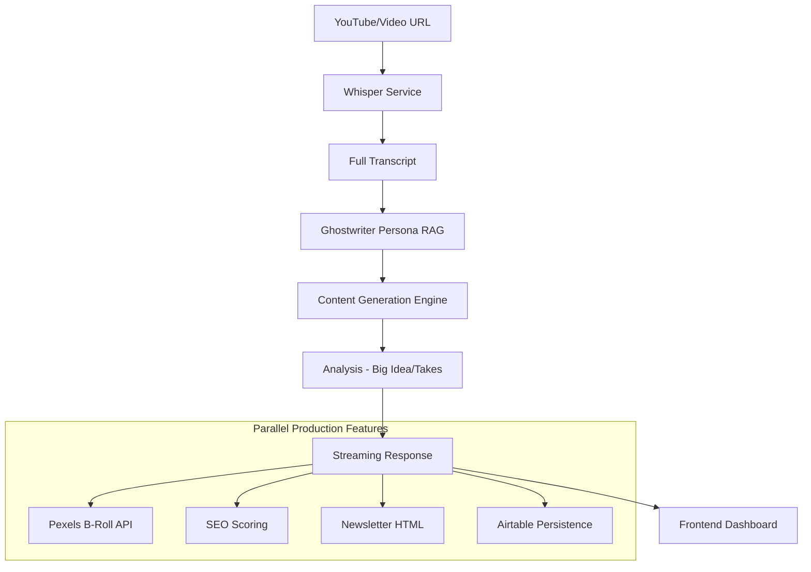

# 🧠 OMNI-CORE: AI Content Repurposing Engine v1.0.0

OMNI-CORE is a high-performance, real-time autonomous agent designed to transform long-form video content (YouTube/Vimeo/Direct) into a comprehensive suite of high-engagement social media assets. It features a "Ghostwriter" Persona Engine that learns your unique writing style through RAG (Retrieval-Augmented Generation).

---

## 🚀 Key Features

### 1. **Real-Time Token Streaming**
Unlike traditional "static" generators, OMNI-CORE uses a state-of-the-art **Server-Sent Events (SSE)** architecture. You can watch the AI "think" and write your content token-by-token in real-time, providing immediate feedback and a ChatGPT-like experience.

### 2. **Ghostwriter Persona Engine (RAG)**
- **Self-Learning Personalities**: Upload your past content (CSV/Text) to train the engine on your specific voice.
- **Style Injection**: The engine automatically retrieves relevant examples from your history during the generation process to match your tone, vocabulary, and formatting (e.g., "Bro-etry" social media style).
- **Multi-Tone Support**: Switch between Professional, Educational, Aggressive, Empathetic, and Inspirational profiles on the fly.

### 3. **Autonomous Execution Pipeline**
- **Transcription-First**: Leverages a dual-strategy for speed—instantly fetching YouTube captions when available, with a high-speed `yt-dlp` fallback for generic videos.
- **Intelligent Analysis**: Extracts "The Big Idea," "Strong Takes," and detected tone from the transcript.
- **Social Asset Suite**:
    - **LinkedIn Posts**: Formatted in high-conversion "Bro-etry" style.
    - **Twitter Threads**: Optimized threads with pattern interrupts and engagement hooks.
    - **Long-Form Blogs**: Markdown-formatted articles ready for Medium or personal sites.
    - **Hook Library**: 5 distinct A/B hook variants (Contrarian, Story, Listicle, Question, Bold Claim).

### 4. **Production-Ready Features**
- **B-Roll Intelligence**: Automatically searches for and extracts relevant B-roll image URLs from the Pexels API based on the content's themes.
- **SEO Scoring**: Real-time analysis of blog posts for keyword density, readability, and structural optimization.
- **Newsletter Engine**: Generates ready-to-send HTML newsletter templates with embedded thumbnails and calls-to-action.
- **Airtable Synchronization**: One-click persistence of all generated assets to an organized Airtable production board.

---

## 🛠 Tech Stack

### **Backend (Python 3.10+)**
- **FastAPI**: High-performance async web framework for the streaming API.
- **LangChain**: Orchestration layer for the LLM chains and RAG.
- **OpenAI GPT-4o / GPT-4o-mini**: Hybrid model strategy for cost and speed optimization.
- **ChromaDB**: High-speed vector database for persona storage and retrieval.
- **Whisper & yt-dlp**: Industrial-strength audio extraction and transcription.

### **Frontend (Next.js 14 / TypeScript)**
- **React Server Components**: Optimized rendering and performance.
- **Framer Motion**: Premium, high-fidelity micro-interactions and animations (Thinking cursor, Glowing orb, etc.).
- **Tailwind CSS**: Custom "Cyberpunk" design system with glassmorphism and neon aesthetics.
- **Lucide React**: Vector-based icon system.

---

## 🏗 System Architecture



---

## 📥 Getting Started

### 1. Environment Configuration
Create a `.env` file in the root directory:
```bash
OPENAI_API_KEY=your_key
PEXELS_API_KEY=your_key
AIRTABLE_API_KEY=your_key
AIRTABLE_BASE_ID=your_id
AIRTABLE_TABLE_NAME=your_table
```

### 2. Backend Setup
```bash
# Install dependencies
pip install -r requirements.txt

# Run the API
PYTHONPATH=$PYTHONPATH:$(pwd) uvicorn app.main:app --reload
```

### 3. Frontend Setup
```bash
cd frontend
npm install
npm run dev
```

---

## 💎 UI Component Highlights

- **Neural Link Sidebar**: A full-height navigation pane with an animated "Neural Hub" (Glowing Orb) and real-time status tracking for every step of the pipeline.
- **Thinking Indicator**: A dedicated real-time display that shows the AI's internal process and token-by-token content generation with a blinking cyber-cursor.
- **Content Display**: A multi-tab, zero-scroll content pane that automatically switches to the highest-priority generated asset.
- **Mini-Input Form**: A compact header-integrated form for quickly re-processing or starting new projects without leaving the dashboard.

---

## 📡 API Endpoints (Core)

- `POST /process-video-stream`: The primary SSE streaming endpoint.
- `POST /style-upload`: Train the Ghostwriter on your past content.
- `GET /style-info/{client_id}`: Check persona training status.
- `POST /airtable-save`: Manually trigger synchronization to the production board.

---

**OMNI-CORE v1.0.0** _ Powered by Advanced Agentic Coding
